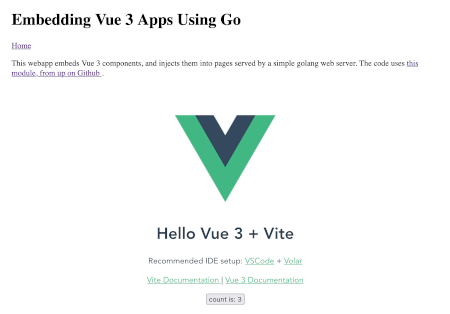

# Test Program for the Vite-Go Module



Here's a program to demonstrate the module. To run it, first add your Vue files. To automatically install the Vue "starter project" on Mac or Linux, the sample program will install Vue 3 for you automatically.

To run development mode:


```shell
$ make dev
```

In development mode, the makefill will:

1. Start the vite dev server.
2. Run the go app using `go run`.
3. Serve the app at [http://localhost:4000](http://localhost:4000).

Development mode uses Vite's hot updating, and is very fast.

To demonstrate building the go app with the built Vue app embedded, run

```shell
$ make preview
```

The makefile will do the following:

1. Build a `frontend/dist` directory from the starter app.
2. Build the go app binary (as `test_program`) from the `main.go` file.
2. Run the Go web server binary in `main.go` and post a sample page at [http://localhost:4000](http://localhost:4000).

The files demonstrate the basics of using vite-go in your go program:

* How to initialize the module and load your Vue files.
* How to set up the standard router in Go to find and serve your Vue-related files.

vite-go examines your package.json file when you run in development mode, and is fairly smart as to what defaults to use for your project. If it guesses wrong, or if you need to change your `vite.config.js` settings, the test program takes a number of flags, which you can use to correct its behavior: 

```shell
Usage of ./test_program:
  -assets string
    	location of javascript files.
  -dist string
    	dist directory relative to the JS project directory.
  -entryp string
    	relative path of the entry point of the js app.
  -env string
    	development|production (default "development")
  -platform string
    	vue|react|svelte
    	
```

You'll need to have the make utility and npm installed for the demo.

The Makefile for the sample project is pretty full featured, since I use it to test this module. Some features you might find useful to test your own project:

| Make Invocation | What It Does |
|:--- |:--- |
| make dev | Runs the program in development mode |
| make stop_dev | Quits development mode |
| make build | Builds the test program |
| make preview  | Builds the test program and runs it in production mode. You can quit with Crtl-C | 

